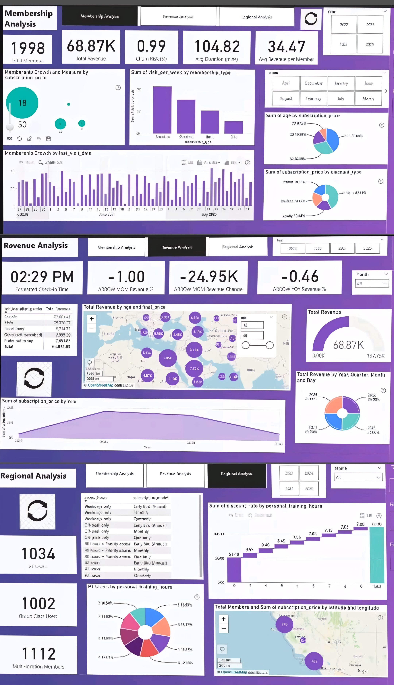

# Fitness-Membership-Analytics-Dashboard

# 🏋️‍♂️ Onyx Data Challenge – August 2025  
# Zoomcharts Mini Challenge
## 📊 Fitness Membership Analytics Report

## Now live at:-

[https://zoomcharts.com/en/microsoft-power-bi-custom-visuals/challenges/onyx-data-august-2025]

This repository contains my submission for the **Onyx Data Challenge – August 2025**, powered by **ZoomCharts**, **Enterprise DNA**, **BCS**, **Smart Frames UI**, and **Data Career Jumpstart**. The challenge focused on analyzing fitness membership data across multiple locations to uncover trends in revenue, engagement, and retention.

---

## 📌 Project Overview

The goal was to build a 3-page interactive Power BI dashboard that delivers actionable insights into:

- Membership growth and churn risk
- Revenue performance and discount strategies
- Regional engagement patterns and personal training usage

---

## 📊 Report Glimpse

## 📄 Report Summary

### 🔹 Page 1: Membership Analysis

- **Total Members:** `1,998`
- **Churn Risk:** `0.99%`
- **Avg Duration in Gym:** `104.82 mins`
- **Avg Revenue per Member:** `₹34.47`
- **Total Revenue:** `₹68.87K`

#### 📈 Visuals:
- **Membership Growth by `subscription_price`** (Bubble Chart)
  - Key values: `₹18`, `₹50`
- **Visits per Week by `membership_type`** (Bar Chart)
  - Premium: `40`, Standard: `30`, Basic: `20`, Elite: `10`
- **Growth by `last_visit_date`** (Bar Chart)
  - Active visits from July 2025
- **Age Distribution by `subscription_price`** (Pie Chart)
- **Discount Type Breakdown** (Pie Chart)

---

### 🔹 Page 2: Revenue Analysis

- **Total Revenue:** `₹68.87K`
- **Formatted Check-in Time:** `02:29 PM`
- **MOM Revenue Change:** `–₹24.95K` (`–1.00%`)
- **YOY Revenue Change:** `–0.46%`

#### 📊 Visuals:
- **Revenue by Age and `final_price`** (Geo Bubble Map)
- **Revenue by Year, Quarter, Month, Day** (Pie Chart)
- **Subscription Price Trends by Year** (Line Chart)
  - Historical range: `2013–2020`

---

### 🔹 Page 3: Regional & Engagement Analysis

- **PT Users:** `1,034`
- **Group Class Users:** `1,002`
- **Multi-location Members:** `1,112`

#### 📍 Visuals:
- **Access Hours vs Subscription Model** (Table)
- **Discount Rate by Personal Training Hours** (Bar Chart)
  - Notable values: `115.60`, `51.90`, `9.55`, `7.05`
- **PT Users by Personal Training Hours** (Pie Chart)
- **Members & Subscription Price by Location** (Geo Bubble Map)
  - Key locations: `799`, `719`, `709` members

---

## 🧠 Key Features

- Dynamic KPI cards with conditional formatting arrows for MOM and YOY trends
- Modular layout with slicers for filtering by membership type, location, and time
- Geo-mapped revenue and engagement metrics
- Time-series analysis using `join_date` and `last_visit_date`
- Clarity-first formatting for educator-friendly insights

---

## 🔗 Resources

- **GitHub Repository:** _Coming soon_
- **Interactive Dashboard Link:** _Will be updated once released by Onyx Data_

---

## 🙏 Acknowledgments

Huge thanks to:
- **Onyx Data** for hosting the challenge  
- **ZoomCharts** for enabling rich visual interactivity  
- **Enterprise DNA**, **BCS**, **Smart Frames UI**, and **Data Career Jumpstart** for supporting the data community

---

## 📬 Contact

Created by **Gyanankur Baruah**  
For clarity-first dashboards, bilingual content, and instructional design  
📧 [gyanankur9@gmail.com] | 🌐 [https://www.linkedin.com/in/gyanankur-baruah-797205338?utm_source=share&utm_campaign=share_via&utm_content=profile&utm_medium=android_app] [https://bold.pro/my/gyanankur-baruah-250802095536]

---
